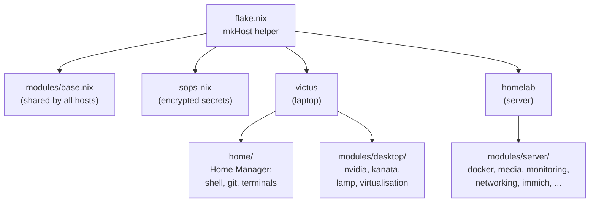
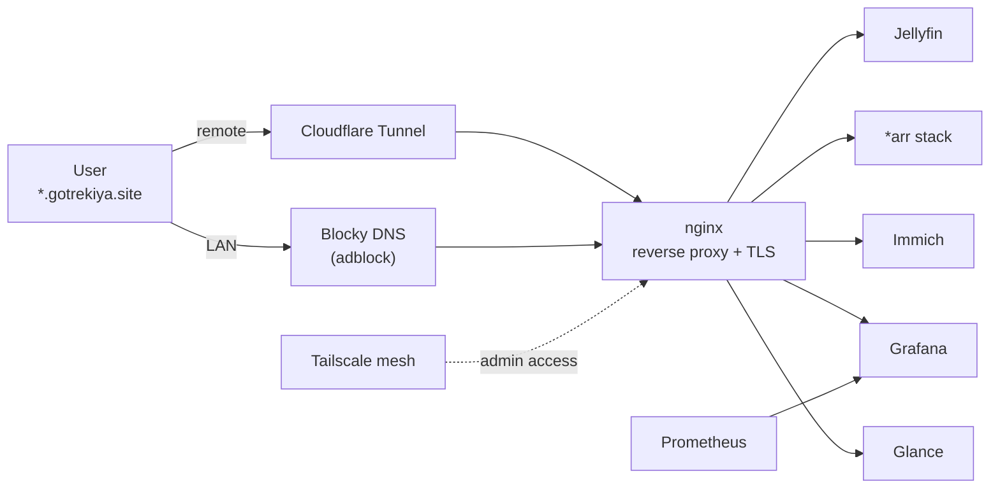

<div align="center">
  <h1>❄️ NixOS Configs ❄️</h1>
  <p>Personal NixOS configuration for two machines: a laptop and a homelab server.</p>

  [](https://github.com/rahulgotrekiya/nix-configs/actions/workflows/flake-check.yml)
</div>

Built with **Nix flakes**, **Home Manager** (integrated as a NixOS module), and
**sops-nix** for secrets. Everything is reproducible and deploys with a single command.

---

## 🧰 What this demonstrates

A complete, reproducible infrastructure managed as code from one repository.

- **Infrastructure as Code:** the full OS, packages, and services are declarative and version-controlled (NixOS flakes).
- **Secrets management:** age-encrypted secrets with sops-nix, safe to keep in a public repo.
- **Reverse proxy + TLS:** nginx with automated Let's Encrypt wildcard certs (Cloudflare DNS-01), vhosts generated from a single service-to-port map.
- **Observability:** Prometheus, Grafana, and Uptime Kuma.
- **Containers:** Docker services managed declaratively, auto-updated with Watchtower.
- **Networking:** Blocky DNS with ad-blocking, Tailscale mesh VPN, Cloudflare Tunnel, fail2ban.
- **Reproducibility:** a pinned `flake.lock` builds an identical system on every machine.

---

## 🖥️ Machines

| Host | Machine | CPU | GPU | Role |
|---|---|---|---|---|
| `victus` | HP Victus 15 | i5-12450H | RTX 2050 | Daily-driver laptop (GNOME) |
| `homelab` | HP ENVY x360 | i5-6200U | Intel HD 520 | Home server (Jellyfin, *arr, Grafana, …) |

> **Branches:** `master` is the current setup above. The old **Hyprland** rice is kept
> on the [`hyprland`](../../tree/hyprland) branch.

---

## 🗺️ Architecture

**How the repo wires up.** One flake, one `mkHost` helper, two machines:



**How a request reaches a homelab service.** Everything enters through one reverse proxy:



---

## 📸 Screenshots

<!-- Replace these with real screenshots once captured. GitHub renders them from a
     committed path (e.g. docs/images/) or a pasted-in upload URL. -->

| Desktop (GNOME) | Glance dashboard | Grafana |
|---|---|---|
| _screenshot_ | _screenshot_ | _screenshot_ |

---

## 📁 Structure

```
dotfiles/
├── flake.nix              # Entry point: mkHost helper, one line per host
│
├── hosts/                 # Per-machine config (host-specific only)
│   ├── victus/            # Laptop: boot, GNOME, audio, NVIDIA, mounts
│   └── homelab/           # Server: systemd-boot, SSH, transcoding, firewall
│
├── modules/
│   ├── base.nix           # Applied to ALL hosts (nix, locale, hostname, networking)
│   ├── desktop/           # Laptop-only feature bundles
│   │   ├── nvidia.nix         # Intel + RTX 2050 PRIME offload
│   │   ├── virtualisation.nix # libvirt / QEMU / KVM
│   │   ├── flatpak.nix        # Flatpak + Flathub
│   │   ├── kanata.nix         # keyboard remapping (home-row mods)
│   │   ├── packet-tracer.nix  # Cisco Packet Tracer
│   │   ├── lamp.nix           # Apache + PHP + MariaDB + phpMyAdmin (local dev)
│   │   ├── terraform.nix      # IaC toolchain          (opt-in, commented)
│   │   └── ansible.nix        # config-mgmt toolchain   (opt-in, commented)
│   └── server/            # Homelab-only services
│       ├── docker.nix         # Docker + Portainer + Watchtower
│       ├── media-server.nix   # Jellyfin + Sonarr/Radarr/Prowlarr/Bazarr/Lidarr + Transmission
│       ├── monitoring.nix     # Prometheus + Grafana + Uptime Kuma
│       ├── networking.nix     # Nginx reverse proxy + ACME + Blocky DNS + fail2ban
│       ├── file-sharing.nix   # NFS + Syncthing
│       ├── cloudflare-tunnel.nix
│       ├── filebrowser.nix
│       ├── glance.nix         # dashboard
│       ├── immich.nix         # photo/video backup
│       └── utsuru.nix         # Jellyfin download manager (+ aria2)
│
├── home/                  # Home Manager (laptop only, run via nixos-rebuild)
│   ├── default.nix        # Entry point
│   ├── shell.nix          # Zsh + aliases + fzf + zoxide + oh-my-posh
│   ├── packages.nix       # User packages, GPG
│   ├── programs/          # git, tmux, alacritty, kitty, neovim
│   └── themes/            # oh-my-posh prompt theme
│
└── secrets/               # sops-nix encrypted secrets
    ├── sops.nix
    ├── common/
    └── homelab/
```

**Layout convention:** `hosts/` = what's unique to one machine, `modules/` = shared
(`base.nix`) or opt-in feature bundles (`desktop/`, `server/`), `home/` = the user env.

---

## ⚙️ Usage

### Prerequisites

Enable flakes (in `/etc/nixos/configuration.nix`, before the first flake build):

```nix
nix.settings.experimental-features = [ "nix-command" "flakes" ];
```

### Clone & apply

```bash
git clone https://github.com/rahulgotrekiya/nix-configs.git ~/dotfiles
cd ~/dotfiles
```

Drop in this machine's hardware scan:

```bash
cp /etc/nixos/hardware-configuration.nix hosts/victus/hardware-configuration.nix
```

Build & switch. **One command builds system + home-manager together:**

```bash
sudo nixos-rebuild switch --flake ~/dotfiles#victus
```

Deploy the homelab (remotely over SSH):

```bash
nixos-rebuild switch --flake ~/dotfiles#homelab --target-host neo@homelab --use-remote-sudo
```

### Handy aliases (from `home/shell.nix`)

| Alias | Command |
|---|---|
| `nrs` | `sudo nixos-rebuild switch --flake ~/dotfiles#victus` |
| `nrb` | `sudo nixos-rebuild boot --flake ~/dotfiles#victus` |
| `,`   | run any nixpkgs binary without installing (`, cowsay hi`) |

---

## ➕ Adding a new host

**1. Hardware config**

```bash
nixos-generate-config --show-hardware-config > hosts/myhost/hardware.nix
```

**2. `hosts/myhost/default.nix`** with only what's unique to the machine:

```nix
{ config, pkgs, ... }:
{
  imports = [ ./hardware.nix ];

  # Shared config (nix settings, locale, hostname, networking) comes from
  # modules/base.nix automatically.
  boot.loader.systemd-boot.enable = true;
  boot.loader.efi.canTouchEfiVariables = true;

  system.stateVersion = "24.11";
}
```

**3. One line in `flake.nix`:**

```nix
nixosConfigurations = {
  victus  = mkHost { hostname = "victus"; user = "rahul"; homeModule = ./home; };
  homelab = mkHost { hostname = "homelab"; user = "neo"; extraModules = [ ... ]; };
  myhost  = mkHost { hostname = "myhost"; };   # ← just this line
};
```

Then `sudo nixos-rebuild switch --flake ~/dotfiles#myhost`.

---

## 🏠 Home Manager

Home Manager is **integrated as a NixOS module**, so there's no separate `home-manager switch`.
`nixos-rebuild switch` builds the system config and user environment atomically. Wiring
lives in the `mkHost` helper in `flake.nix`; pass `homeModule = ./home;` to enable it for
a host, or omit it for headless servers (the homelab has no home-manager).

---

## 🔐 Secrets (sops-nix)

Secrets are **age-encrypted** with [sops-nix](https://github.com/Mic92/sops-nix) and safe
to commit. The private age key is generated from the host's SSH key at
`/home/neo/.config/sops/age/keys.txt` and never leaves the machine. Recipients and
per-directory rules live in `.sops.yaml`; encrypted values in `secrets/`.

Edit a secret:

```bash
sops secrets/homelab/services.yaml
```

`.gitignore` blocks decrypted files and raw keys from ever being committed.

---

<p align="center">Thank you ❤️</p>
